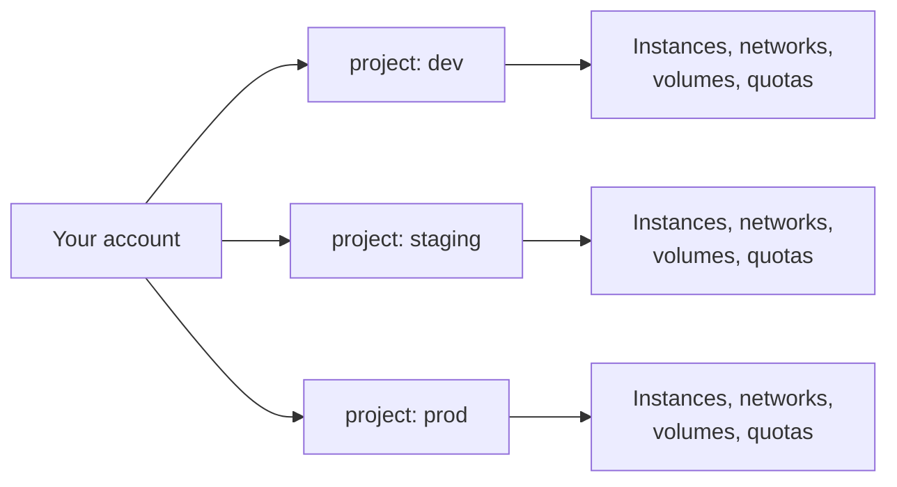

# Platform overview

The Wahda Cloud is a **pay-as-you-go public cloud** in India. You get on-demand virtual machines, managed databases, virtual networking, block and object storage, and identity — all managed from a single web console.

This page is the shortest useful description of how the platform is organized. If you're new here, read it once and keep the map in your head as you move through the other guides.

---

## Regions and availability zones

Every resource you create lives in exactly one **region**. A region is a physical data-centre location.

| Region | Location | Availability zones |
|---|---|---|
| `in-north-1` | North India (Hyderabad) | `in-north-az1` |

Inside a region, an **availability zone (AZ)** is a failure-isolated compartment — separate power, cooling, and network paths. For workloads that must survive a single-AZ outage, spread your instances across multiple AZs.

:::note One AZ today, more soon
`in-north-1` currently exposes a single AZ (`in-north-az1`). Additional AZs and a second region are on the roadmap. Nothing you build today needs to change when they land.
:::

---

## Projects

A **project** is the tenant boundary. Everything you create — instances, networks, volumes, floating IPs, database instances, security groups — belongs to exactly one project.

Why it matters:

- **Isolation.** Instances in `dev` can't reach instances in `prod` unless you explicitly connect them.
- **Quotas** — instance count, vCPU, memory, volume storage — are enforced **per project**.
- **Access control.** You grant a teammate access to a specific project, not the whole account.
- **Billing.** Each project rolls up its own usage on the invoice.

See [Projects →](/getting-started/projects-and-quotas) for how to create, switch, and size projects.

---

## Services

| Service | What you get |
|---|---|
| **Compute** | Linux and Windows VMs. Standard, memory-optimized, and CPU-optimized shapes. |
| **Block Storage** | Persistent SSD-backed volumes you attach to instances. Snapshots. |
| **Object Storage** | S3-compatible bucket storage for unstructured data and static assets. |
| **Networking** | Private networks, subnets, routers, security groups, floating (public) IPs. |
| **Load Balancer** | Managed L4/L7 load balancing (Octavia) for HA services. |
| **Databases (DBaaS)** | Managed MySQL/MariaDB with backups, replicas, and config groups. |
| **Identity** | Users, projects, roles, application credentials, keypairs. |

Each service has its own section in the sidebar. **Compute** and **Networking** are what most people touch first.

---

## How you access it

Everything runs through the web console at [`console.thewahda.com`](https://console.thewahda.com). It's a full management surface — provision VMs, wire up networks, size databases, manage users and quotas — all from the same place.

:::note Automation is coming
A first-party Terraform provider and a scripting CLI are on the roadmap for teams that want to codify their infrastructure. Until then, the console is the supported entry point.
:::

---

## Billing model

Pay-as-you-go. You are billed **only for what you use**, per hour, with a monthly invoice.

- **Instances** — billed per hour of `Active` state, based on the flavor (vCPU + memory).
- **Block volumes** — billed per GB per month, prorated to the second while attached or detached.
- **Object storage** — billed per GB stored + egress out of the region.
- **Floating IPs** — billed per hour while allocated.
- **Load balancers, DBaaS** — billed per hour of running state.

Stopping an instance still bills the attached volumes; deleting the instance stops all compute charges. There is no upfront commitment and no minimum term.

---

## Next steps

- [Sign up & first login →](/getting-started/sign-up) — create an account and log in.
- [Projects →](/getting-started/projects-and-quotas) — how projects group your resources and what to do when you need more room.
- [Create your first VM →](/compute/create-vm) — the fastest end-to-end walkthrough.
