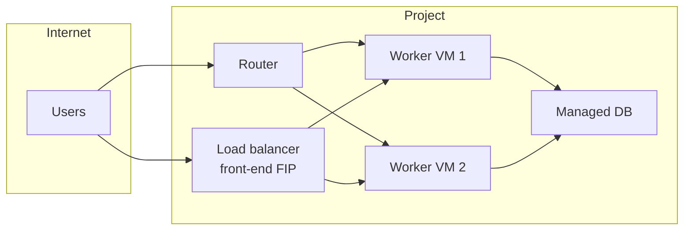

# Networking overview

Every project on The Wahda Cloud gets its own **private network fabric** — networks, subnets, routers, security groups — with an on-ramp to the public internet through floating IPs and, when you need it, a **managed load balancer** or an **IPsec VPN** into another site.

This page is the shortest useful map of what's available. Each linked section goes deep on one piece.

---

## The pieces

| Piece | What it does | When you touch it |
|---|---|---|
| **Network** | An L2 broadcast domain inside your project. Instances attached to the same network can talk to each other directly. | Every VM lives on exactly one network. Most projects use one `demo-network-vpc` and grow from there. |
| **Subnet** | An IP range (CIDR) inside a network, with a DHCP server. | The subnet auto-assigns each VM an IP as it boots. |
| **Router** | Bridges a private network to the outside world (SNAT for outbound) and hosts floating IPs (DNAT for inbound). | You want VMs on a private network to reach the internet, or you want to give a VM a public IPv4. |
| **[Security group →](/networking/security-groups)** | A stateful firewall attached to the VM's port. Default: block everything inbound. | You want to expose port 22, 80, 443, or anything else — you attach a security group with that rule. |
| **[Floating IP →](/networking/floating-ips)** | A public IPv4 you allocate to your project and attach to a VM. | You want a VM reachable from the internet at a stable address. |
| **[Port forwarding →](/networking/floating-ips#port-forwarding--one-fip-many-services)** | Forward individual ports on a floating IP to different internal VMs. | You want one FIP to expose several services running on different VMs. |
| **[Load balancer →](/networking/load-balancer)** | A managed L4/L7 load balancer that fronts multiple backends. | You have more than one VM answering the same traffic and want a single entry point with health checks. |
| **[VPN →](/networking/vpn)** | Site-to-site IPsec — a permanent encrypted tunnel between your project's router and a remote site (your office, another cloud, another region). | You want your on-prem network and this project on the same private plane, without exposing anything to the internet. |

---

## A typical layout

Public users hit the load balancer's floating IP; the LB spreads traffic across two worker VMs; workers talk to a managed database over the private network. The router is only for admin SSH or outbound package installs.

---

## What you'll do most often

- **Attach a security group** — mandatory before anyone can SSH into a new VM. See [Security groups →](/networking/security-groups).
- **Attach a floating IP** — the single step that turns a private VM into a publicly-reachable one. See [Floating IPs →](/networking/floating-ips).
- **Front two or more VMs with an LB** — the moment you have more than one instance serving the same thing, put a load balancer in front. See [Load balancer →](/networking/load-balancer).
- **Bridge to another site with a VPN** — when your on-prem and your cloud need to be on the same private plane. See [VPN →](/networking/vpn).

---

## Next steps

- [Security groups →](/networking/security-groups) — open ports the right way.
- [Floating IPs →](/networking/floating-ips) — assign public IPv4 to a VM.
- [Load balancer →](/networking/load-balancer) — spread traffic across multiple backends.
- [VPN →](/networking/vpn) — site-to-site IPsec tunnel.
